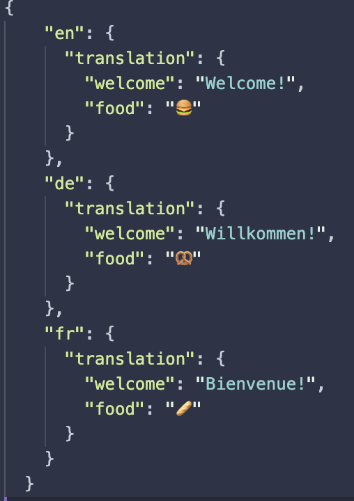

# React (Native) Translation Workflow - Showcase
Showcase of a workflow + script on how to collaborate with a team of translators on a excel file, transform it into a JSON file and use it in a react native app. (This can be also applied for a React Web App and even other frameworks)

Also contains a small React Native app that uses the react-i18n library to provide translations to directly test the workflow.

[](docs/Screenshot_en.png)
[](docs/Screenshot_de.png)
[](docs/Screenshot_fr.png)

Via the `NativeModules`, the device language can be obtained and the app will be automatically translated to the respective language. If the specified language is not available, the app will fallback to English. The following example shows the app with Spanish (es) as device language - the app is shown in English due to the fallback.  

[](docs/Screenshot_es.png)

> **Not implemented**: You can store the language preference of the user in the `AsyncStorage` and apply it while launching the app. Then the user is only required to change the language once.

## Get started
```
yarn install
yarn ios
```
## Changing / Insert translations
* Edit the translation excel spreadsheet
* Run the `readFromExcel.py` script. Note, that you can adjust the path and the filename of the translation excel spreadsheet and the resulting  json file in the `.env` file. By doing so, you can also setup the path to a shared directory where you can collaborate with colleagues.
* Use the new keys in the app
### Excelsheet
[](docs/excelExample.png)
### Resulting JSON file
[](docs/excelAsJson.png)

## Automatically add translations in the excel spreadsheet via service (e.g. AWS Translate)
For quick iterations on your app, you might want at least some translations - even if they are not 100% correct. One way to do this is to add the english translation of the key and to add required language keys in the excel spreadsheet. Then we can iterate over these keys and add the missing translations by using a service like `AWS Translate`.

> **Not implemented**: To be continued 